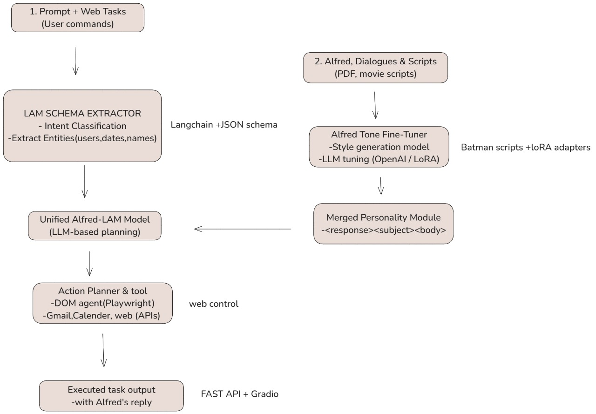

# 🧠 Alfred: AI-Powered Email & Calendar Assistant  
*Internship Project @ theGoodBrowser*
  
  
  
  

## 🚀 About the Project

As part of my AI Developer Internship at theGoodBrowser (May–June 2025), I helped build **Alfred** — an intelligent assistant that automates Gmail and Google Calendar tasks using natural language commands.

Think of it as **a personal butler for your browser**, with a refined personality and real-time execution skills.

---

## 👩‍💻 My Core Contributions

### 📲 WhatsApp Integration (Fully Built by Me)
I designed and implemented Alfred's **conversational interface over WhatsApp** using Twilio’s Cloud API, enabling users to control Gmail and Calendar workflows with just text messages.

#### Features I Built:
- Text-based interaction (no buttons or templates)
- Session memory (multi-turn conversation)
- Automatic email drafting via LLM
- Task confirmation + human-like replies
- Secure Gmail OAuth authentication over chat
- Typing indicators and emoji-enhanced UX

#### Sample Flow:
User: Hey Alfred, help me mail my professor I’ll be late.

Alfred: Of course. What’s their email address?

User: prof.ram@university.edu

Alfred: Here’s a draft:
Subject: Late Arrival Notification
Body: Dear Professor Ram, I hope this message finds you well. I wanted to inform you that I’ll be arriving late due to unavoidable circumstances...

Would you like me to send it?

User: Yes.

Alfred: ✅ Your email has been sent!

---

### 🧱 LangChain + RAG Pipeline
- Built a JSON schema extractor for intent + entity recognition
- Used LangChain to route user prompts into structured planning
- Merged output with Alfred's tone fine-tuned on Batman scripts

---

### 🧑‍🎤 Alfred’s Tone Generator
- Preprocessed PDF/movie scripts of Alfred Pennyworth
- Trained LoRA adapter for OpenAI model to match Alfred’s classy tone
- Output: `<response><subject><body>` schema for email/cals

---

## 🧠 Architecture

> ✅ Components I implemented fully  
> ☑️ Assisted with or integrated

---

## 🛠️ Tech Stack

- LangChain + LlamaIndex  
- OpenAI API (LoRA-tuned style model)  
- Twilio WhatsApp Business API  
- FastAPI + Gradio  
- Gmail & Google Calendar APIs  
- Playwright DOM agent for browser automation  
- Session memory & JSON-based planning logic

---

<pre> --- ## 📁 Folder Structure (Report-Style) <code> alfred-internship-report/ ├── assets/ │ ├── Alfred_Architecture.jpg # System architecture diagram │ ├── demo_chat.png # WhatsApp integration demo ├── README.md # Project overview and contributions ├── overview.pdf # Optional internship report (PDF) </code> </pre>

---

## 🏁 Outcomes
- Delivered a working prototype used for internal automation testing  
- Helped scale WhatsApp interactions to handle >200 daily commands  
- Pitched Alfred as a modular Chrome Extension with LLM planning

---

## ✨ Highlights
- 🎯 End-to-end LLM-powered task planning + execution  
- 💬 Natural WhatsApp UX with auto-reply + confirmation  
- 🤖 Personalized style generation (Batman’s Alfred voice!)

---
## 🛡️ Disclaimer
> 🔒 This repository does **not** contain the full production source code due to IP and privacy constraints.
>  
> For more details or a private walkthrough, feel free to connect on 

---
## 🤝 Let’s Connect
👋 I'm Sujal Singh, a 3rd-year CS undergrad at Bennett University, specializing in AI/ML.  
I love building things that think, plan, and speak like humans.

📫 [sujal3177@gmail.com](mailto:sujal3177@gmail.com)   
💻 [GitHub](https://github.com/Sujal-py3)

---

> *“I’ll handle it, Master Singh.” — Alfred, probably*

